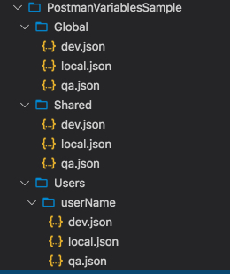

# Custom variables in Postman using Github

## Summary

We created this implementation to address some of the short-comings in Postman variable management. The first issue was how to mass update variables within postman with the removal of the bulk edit feature, while not having to deal with the massive custom JSON object that is the data backing to the current Postman bulk edit modal. The second issue was how to keep our entire teams variables up to date and in sync for values that were required for API testing but that changed over time. Using team templates is not user friendly, and requires multiple new imports to re-sync variables, which also then forces you to lose any one off variable changes made.

 This implementation provides the following advantages:

  1. Change tracking
  2. Edit history
  3. Real time updating of shared variables

## Setup Summary

1. Create new Github Repository for storing the variable files
2. Add a new post request to your Postman collection for base-lining variables
3. Adde the Pre-script and post-script code to that baseline request

## GitHub files and structure

1. Create a repository named **Postman-Variables**
2. Setup the following folder structure

    [](./documentation/PostmanGitFolders.jpg)
3. Create JSON files in each user folder that should be applied to postman when base-lining for each given environment.

### Variable Scopes

1. **Global**: Contains variables that are required per the environment and rarely change.
2. **Shared**: Contains all variables that are not considered global. When a new variable is created by a developer it should be added here for each environment file. This will make it available for all Postman Users.
3. **User**: This contains static user specific overrides. These will overwrite the shared variable of the same key if it exists. Every user will have a folder containing their specific overrides.

**Note**: Global variables are overridden by shared variables, which are overridden by User variables.

### File structure

In each of the folders add your variables in this format

```JSON
[
  {
    "key": "<VARNAME>",
    "value": "<VALUE>"
  }
]
```

### Setting up access

1. In Github under the account go to settings
2. Select Developer Settings
3. Create a new OAuth Application
   - Ensure public repo access is checked
4. Save the ClientId and ClientSecret created for use later in Postman

## Setup Postman

### Update Postman Settings

- Set **Automatically persist variable values** is set to ON

[](./documentation/PostmanSettings.jpg)

## Create the baseline environment templates

Create the following environments

1. LocalVariables
2. DevVariables
3. QAVariables

[](./documentation/PostmanManageEnv.jpg)

Add the following variables to each template within postman

- **environment**: this value will match the folder names from your GitHub repository structure you created above
- **username**: this is the username of the folder in the github repository that contains the specific variables to retrieve

[](./documentation/PostmanVariablesRequired.jpg)

**NOTE:** if working in Postman team import each of those environment templates into your workspace as a duplicate

### Setup Collection Global Variables

In your collection we need to add a couple global variables that will allow access across environments to gather our github stored variables

Add the following global variables

- baseGithubUrl - base url for access the files in github
- globalVariablesPath - Relative path in the repo to the global variable files
- sharedVariablesPath - Relative path in the repo to the shared variable files
- githubClientId - Client id generated above from GitHub
- githubClientSecret - Client secret generated above from GitHub
- githubUser - Github account housing the variables repo
- githubRepoName - Name of the repo created to house the variables

[](./documentation/PostmanGlobalVars.jpg)

#### Validating access

To ensure we have access to the Github repository based on the variables above we can test with the following postman GET request url

```TEXT
{{baseGithubUrl}}{{githubUser}}/{{githubRepoName}}/master/Global/{{environment}}.json?client_id={{githubClientId}}&client_secret={{githubClientSecret}}
```

If all is connected correctly Postman should return
[](./documentation/PostmanTestConnection.jpg)


### Setup the baseline variable request

1. Create a new folder in your collection **Baseline Environment Variables**
2. Create a new GET request
   - Set the url to

```TEXT
{{baseGithubUrl}}{{githubUser}}/{{githubRepoName}}/master/Users/{{username}}/{{environment}}.json?client_id={{githubClientId}}&client_secret={{githubClientSecret}}
```

3. Edit the folder and add the following to the **Pre-request Scripts**

    ```JAVASCRIPT
    var baseGithubUrl = pm.variables.get("baseGithubUrl");
    var githubUser = pm.variables.get("githubUser");
    var githubRepoName = pm.variables.get("githubRepoName");
    var githubClientId = pm.variables.get("githubClientId");
    var githubClientSecret = pm.variables.get("githubClientSecret");
    var authQueryString = "?client_id=" + githubClientId + "&client_secret=" + githubClientSecret;
    var baseUrl = baseGithubUrl + githubUser+"/" + githubRepoName + "/master/";

    var globalVariablesUrl = pm.variables.get("globalVariablesPath").replace("{0}", pm.variables.get("environment"));
    var sharedVariablesUrl = pm.variables.get("sharedVariablesPath").replace("{0}", pm.variables.get("environment"));


    pm.sendRequest({
        url:  baseUrl + globalVariablesUrl,
        method: 'GET',
    }, function (err, response) {
        if(err){
            console.error("Pre-Request Error", err, response.text());
        }
        var globalBaseline = response.json();
        globalBaseline.forEach(function(item) {
            pm.environment.set(item.key, item.value);
        });
        //now get any shared overrides to the global requests

        pm.sendRequest({
            url:  baseUrl + sharedVariablesUrl,
            method: 'GET',
        }, function (err, response) {
            if(err){
                console.error("Pre-Request Error", err, response.text());
            }
            var sharedVariables = response.json();
            sharedVariables.forEach(function(item) {
                pm.environment.set(item.key, item.value);
            });
        });
    });
    ```

4. Update the **Test** tab in the request with

   ```JAVASCRIPT
    var userOverrides = pm.response.json();

    userOverrides.forEach(function(item) {
        pm.environment.set(item.key, item.value);
    });
   ```

The final request should look like

[](./documentation/PostmanVarRequest.jpg)

If you no check the variables list it will show all the imported variables from GLOBAL, SHARED and USER

[](./documentation/PostmanVarsSetAfterRequest.jpg)

## How to use

To take advantage of this system we implemented the following workflow

As a developer we would clone the repo locally and update all profiles and Gloabl and Shared files as necessary when API changes happened that would effect current settings. Then everyone only had to **Get Latest** to get those updates and use locally.

As a QA tester, they were given rights to the GitHub repo and allowed to update their userName folder files and set what ever baseline variables they wanted for their testing purposes and commit those changes.

As API changes moved that required Postman value changes moved through the environments we would all as a team "Baseline" for the given environment which would update the GLOBAL and SHARED values for everyone. This has really helped with syncing new values for new APIs and updating clientIds and stuff based on API changes. This has also allowed for helping QA through issues cause we can easily pull their username files down locally and we have everything in our local environment the QA has and we an see what values may be off and correct them.

The great thing is this does not affect how Postman already works with variables so we can still customize per request as im scenario testing just like we regularly do. We **ONLY** baseline when something on a wider scale has changed in an API as part of our regular planned sprint work. The power then also comes with the username custom variables so if we have personal values and stuff only for me those are all tracked in source control only our team has access to and has history to them all to so rollback is easily accomplished at this point.

## References
- [Github API](https://developer.github.com/v3/#http-verbs)
- [Creating an OAuth App in Github](https://auth0.com/docs/connections/social/github)
- [Request OAuth token from API](https://developer.github.com/apps/building-oauth-apps/authorizing-oauth-apps/)

All screen shots taken running **localVariables** as the environment
